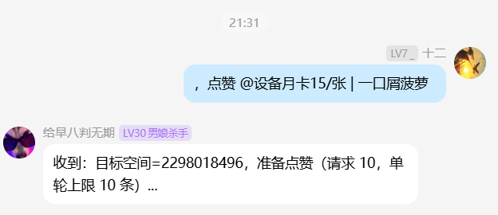
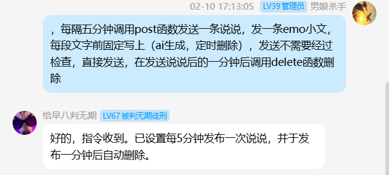
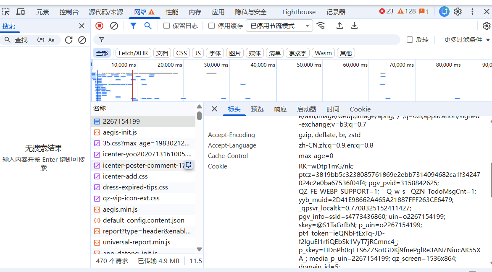

# QQ空间自动化插件（定时/点赞/发说说/删说说）

AstrBot 插件：QQ 空间自动化工具箱，覆盖“自动点赞 + 定时发说说 + 定时删说说”。

一句话：你负责把 Cookie 填好，它负责在后台跑任务；出问题时看日志就能快速定位 `cookie失效/风控/验证码`。

> 安全提示：本插件需要你自己提供 QQ 空间 Cookie（登录态）。不要把 Cookie 提交到仓库，也别发到群里。

## 亮点

- 强日志：请求状态码、返回片段(head)、命中数量、失败原因一目了然
- 后台轮询：按间隔持续扫描 feeds，发现新 mood 自动点赞
- 去重策略：自动轮询使用“内存去重 + TTL”（避免重复点赞刷风控）；手动 `/点赞` 默认不去重
- 一键启停：WebUI 开关 `enabled/auto_start` + 命令 `/qz_start /qz_stop /qz_status`
- 可选目标空间：默认自己的空间，也支持指定 `target_qq` 或通过 `/点赞 @某人` 临时切换
- 附带工具：`/post` 发文字说说，`/genpost` 用 LLM 生成后再发（可选）

## 效果截图

按顺序：

自定义点赞：

## 交流群

不懂的进 QQ 交流群：`460973561`。

## 安装

1. 将整个插件目录放入 AstrBot 插件目录（目录名建议：`qzone_auto_like`）
2. 重启或重载 AstrBot
3. 打开 WebUI 插件配置，填写 `my_qq` 和 `cookie`

## 配置项（WebUI）

必填（不填就跑不起来）：
- `my_qq`：当前登录 QQ 号（用于 referer/opuin）
- `cookie`：QQ 空间 Cookie（至少包含 `p_skey=...`，否则无法计算 `g_tk`）

### 如何获取 Cookie（Chrome / Edge）

1. 浏览器打开并登录 QQ 空间：`https://user.qzone.qq.com/<你的QQ号>`
2. 按 `F12` 打开开发者工具，进入 `Network(网络)`
3. 刷新页面（`F5`），在请求列表里找到 `feeds_html_act_all`（或任意 `user.qzone.qq.com/proxy/domain/ic2.qzone.qq.com/cgi-bin/feeds/...` 请求）
4. 点开该请求 → `Headers(标头)` → `Request Headers(请求标头)` → 复制 `cookie: ...` 的整行内容
5. 粘贴到本插件配置里的 `cookie`

示例图：

提示：
- Cookie 属于登录态，千万不要发到群里/仓库/截图里
- 失效后重新按以上步骤复制最新 Cookie

开关：
- `enabled`：是否启用后台轮询（总开关）
- `auto_start`：Bot 启动后若 enabled=true 自动启动（适合常驻）

调参：
- `poll_interval_sec`：轮询间隔（秒）
- `like_delay_min_sec` / `like_delay_max_sec`：点赞前随机延迟范围（默认已放慢，降低风控概率）
- `max_feeds_count`：每次拉取动态数量
- `like_ramp_step`：仅在手动 `/点赞` 指定次数 > 10 时生效；feeds 的 count 将按 `10->20->...` 递增（默认 10）
- `auto_dedup_ttl_sec`：自动轮询去重 TTL（秒，默认 86400=24h；0 表示不去重）

AI 自动发说说（可选）：
- 本插件内置“固定配置模式”（老的本地 scheduler），也支持配合 AstrBot 的「未来任务」使用 `qz_post/qz_delete` 工具来实现更灵活的定时。
- 如果你启用了 AstrBot 的「主动型能力」，你可以在群里用自然语言创建未来任务（例如“每隔五分钟发一条说说 …”），AstrBot 会按时唤醒并调用本插件工具。

自动发说说（固定配置模式，按 WebUI 配置运行）：
- `ai_post_enabled`：启用自动发说说
- `ai_post_mark`：是否在正文开头加 `【AI发送】`
- `ai_post_provider_id`：指定使用的 LLM 提供商（留空=用默认）
- `ai_post_interval_min`：每隔多少分钟发一条（0=关闭 interval）
- `ai_post_prompt`：interval 模式提示词
- `ai_post_daily_time`：每天定时（HH:MM，留空=关闭 daily）
- `ai_post_daily_prompt`：daily 模式提示词
- `ai_post_delete_after_min`：发布后多少分钟自动删除（0=不删）

工具调用回显（刷屏控制）：
- `llm_tool_reply_mode`：控制 `qz_post/qz_delete` 工具调用后是否在当前会话回消息
  - `all`：成功/失败都回（会看到 `OK` / `FAIL ...`）
  - `error`：仅失败回（默认，成功静默）
  - `off`：全部静默（只看后台日志）

通知（跨会话推送，2026-02 现状说明）：
- 由于不同 AstrBot/适配器版本对“跨会话主动发消息”的 API/MessageType 支持不一致，本插件默认不对“成功”做主动推送，避免刷屏。
- 失败排查建议优先看后台日志（`status/code/msg/head`）。

可选：
- `target_qq`：默认目标QQ空间（留空=自己的空间；也可用 `/点赞 ...` 临时切换并立即执行）

## 命令

- `/qz_start`：启动后台任务（同时会把 enabled 置为 true）
- `/qz_stop`：停止后台任务（同时会把 enabled 置为 false）
- `/qz_status`：查看运行状态、enabled/auto_start、目标空间、缓存数量
- `/点赞 @某人 [次数]`：立即点赞对方空间的动态（默认 10，上限 100）。注意：次数只在你明确输入时才会生效，避免被适配器/文本误解析成 100。
- `/点赞 QQ号 [次数]`：立即点赞指定 QQ 空间的动态（默认 10，上限 100）。
- `/post 内容...`：发一条纯文字说说（失败会在后台输出回包 head 便于排查）
- `/genpost 主题/要求...`：调用 AstrBot 已配置的 LLM 生成说说后自动发送

提示：如果目标空间拉取失败，后台日志可能出现 `need login`，通常是 Cookie 不完整/失效，或触发风控/验证。

## 后台日志说明

你会看到类似日志：

- `[HH:MM:SS] 正在侦测...`
- `[Qzone] feeds 返回 | status=... text_len=... keys=...`
- `[Qzone] like 返回 | status=... resp_head=...`

如果 `feeds status != 200` 或 `like 返回内容不是 "code":0`，通常是：
- Cookie 失效
- 触发风控/验证码
- 频率过高

## 开源许可

MIT License
